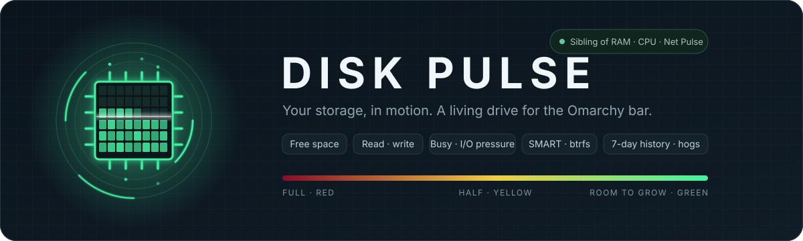
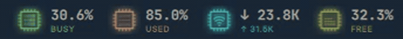
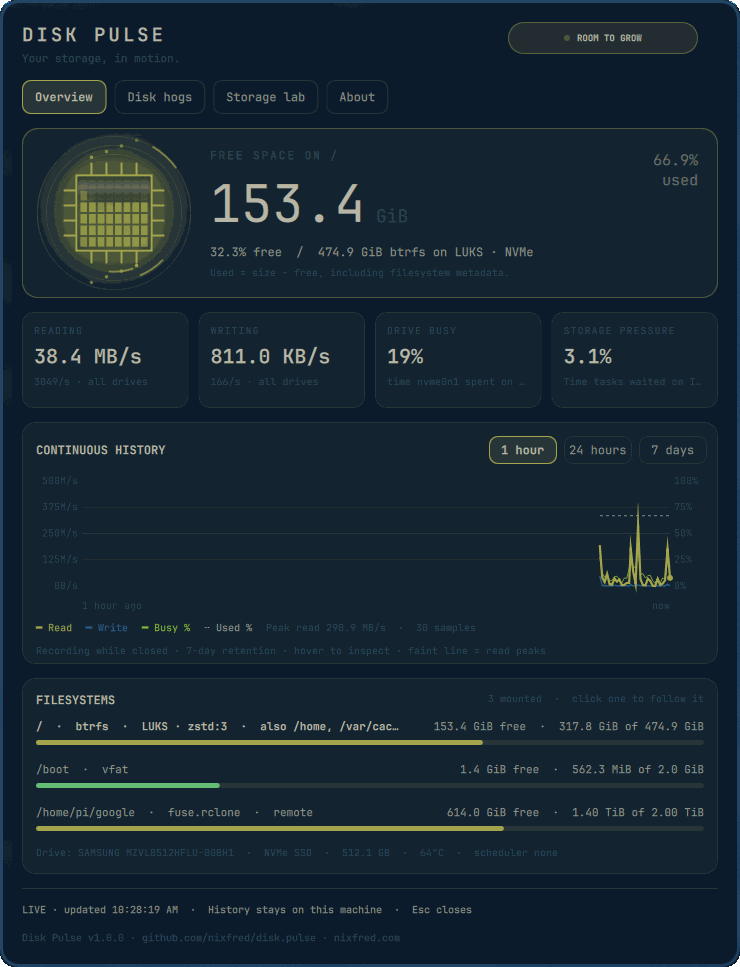
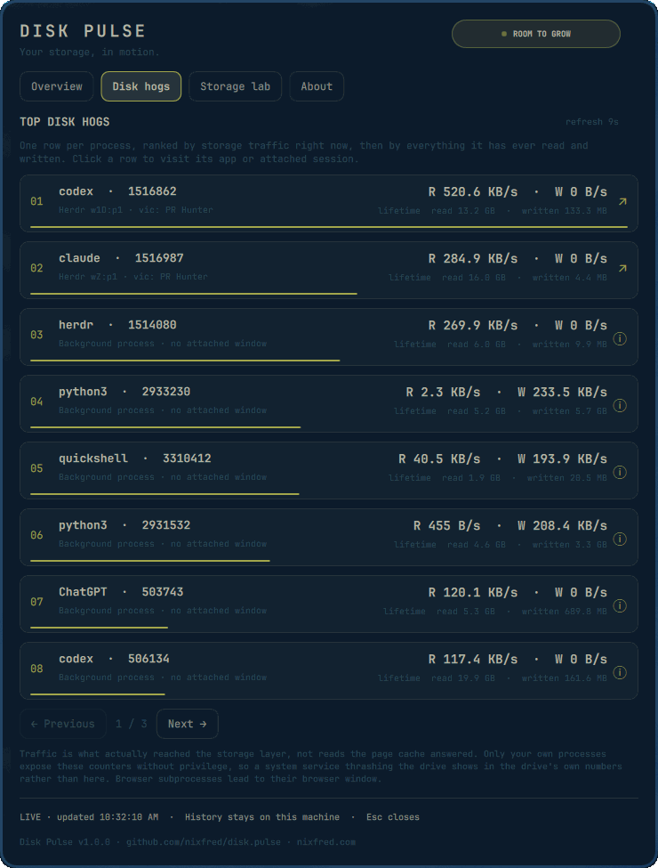
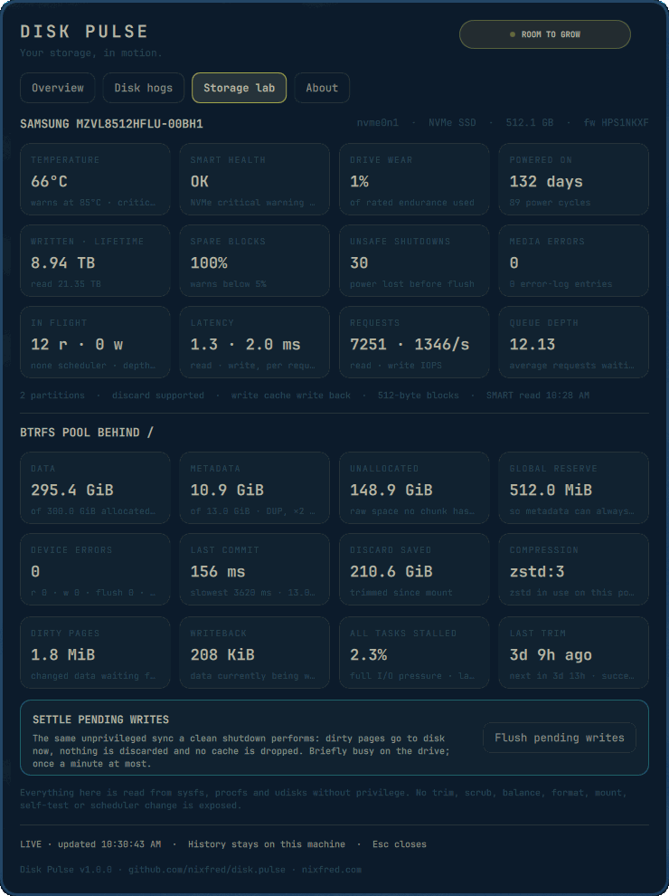
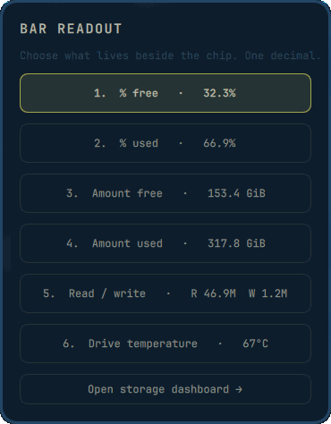
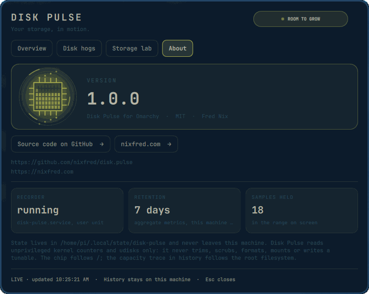

<p align="center">
  
</p>

<p align="center">
  <a href="#install"></a>
  <a href="LICENSE"></a>
  <a href="https://github.com/nixfred/ram.plugin.omarchy"></a>
  <a href="https://github.com/nixfred/omacpu"></a>
  <a href="https://github.com/nixfred/omanet.plugin.omarchy"></a>
  
</p>

# Disk Pulse

An animated, glowing storage die for the Omarchy top bar. Green with room to grow → yellow at half full → dark red when the disk is nearly out of space. The die is a map of flash blocks that light up as the filesystem fills, a read/write beam sweeps the map faster as traffic rises, reads leave through the top pins and writes arrive through the bottom ones.

<p align="center">
  
  <br>
  <sub>CPU Pulse, RAM Pulse, Net Pulse and Disk Pulse on one bar. Same chip, same colour language.</sub>
</p>

Left-click opens the dashboard. Right-click offers six saved readouts: percentage free, percentage used, amount free, amount used, read and write throughput, drive temperature. All readouts use one decimal and explicit units.

Disk Pulse is the sibling of [RAM Pulse](https://github.com/nixfred/ram.plugin.omarchy), [CPU Pulse](https://github.com/nixfred/omacpu) and [Net Pulse](https://github.com/nixfred/omanet.plugin.omarchy): same chip, same colours, same dashboard layout, so the four sit together on the bar.

## The dashboard

<table>
  <tr>
    <td width="50%" valign="top">
      
    </td>
    <td width="50%" valign="top">
      
    </td>
  </tr>
  <tr>
    <td valign="top"><b>Overview.</b> Hero die with the block map, free space on the filesystem the chip follows, read and write throughput, how busy the drive is, I/O pressure, 1-hour / 24-hour / 7-day history of throughput, capacity and busy time, and a row per mounted filesystem with its own headroom bar. Click a filesystem to make the chip follow it.</td>
    <td valign="top"><b>Disk hogs.</b> Top 24 processes by storage traffic right now, then by everything they have ever read and written, eight per page. Click a row to focus its existing window or attached Herdr / tmux pane. Background processes report details instead.</td>
  </tr>
  <tr>
    <td width="50%" valign="top">
      
    </td>
    <td width="50%" valign="top">
      
    </td>
  </tr>
  <tr>
    <td valign="top"><b>Storage lab.</b> The drive behind the followed filesystem: temperature against its warning threshold, SMART health, wear, power-on time, lifetime bytes written and read, spare blocks, unsafe shutdowns, media errors, requests in flight, per-request latency, IOPS and queue depth. Then the btrfs pool behind that filesystem — data and metadata chunks, unallocated space, the global reserve, device error counters, commit timing, discard savings, compression — dirty and writeback pages, full I/O pressure, the fstrim timer's last and next run, and a flush for pending writes.</td>
    <td valign="top"><b>Readout picker.</b> Right-click the chip to choose what lives beside it. Keys 1–6 pick a mode; the choice is saved to your bar layout.</td>
  </tr>
  <tr>
    <td colspan="2" valign="top">
      
    </td>
  </tr>
  <tr>
    <td colspan="2" valign="top"><b>About.</b> Which build you are running, plus where it came from: the version read straight from <code>manifest.json</code>, the licence, and buttons to the source repository and to nixfred.com. Both addresses are printed in full underneath for when no browser is on hand.</td>
  </tr>
</table>

## What it does

- Animated die whose block map fills with the filesystem and whose beam, rings and pin traffic follow real read and write throughput.
- Free space, used space, read and write throughput, IOPS, drive busy time and I/O pressure (PSI), refreshed every three seconds.
- Continuous 1-hour, 24-hour and 7-day history of read and write throughput, capacity used and drive busy time, with the per-bucket read peak as a faint envelope and hover readings. Missing history is left blank; shutdowns and recording gaps break the trace.
- Every mounted filesystem, one row each: a btrfs pool mounted as five subvolumes is one row that names the other four. LUKS, compression, read-only and remote mounts are badged. Network and userspace filesystems are measured on a deadline, so a share that stops answering is reported as such rather than freezing the panel.
- Drive health without root: temperature from the kernel's hwmon sensor, and SMART through udisks — NVMe wear, spare blocks, lifetime bytes, unsafe shutdowns, media errors and critical warnings; SATA overall assessment, bad sectors and power-on time.
- Everything the btrfs sysfs tree exposes to an ordinary user: chunk allocation per space with its profile, unallocated space, the global reserve, per-device error counters, commit timing and discard savings.
- The fstrim timer's last and next run, dirty and writeback pages, and the same asynchronous **Flush pending writes** RAM Pulse offers, limited to once a minute.
- Top 24 processes by storage traffic. Exact Boomux terminal titles can resolve an existing terminal too. Browser children focus their browser window, not an individual tab.
- Follows the active Omarchy theme. Panel, cards, borders, text and buttons resolve from the theme's popup surface, and the die and history traces take the theme's own red, yellow and green.

There are no trim, scrub, balance, format, mount, self-test, scheduler or privileged tuning actions. Processes and window identities are revalidated on every focus click. Session routing uses argument arrays and validated IDs, never interpolated shell commands. No process command lines, drive serial numbers or credentials are saved.

## Install

Requires an existing Omarchy Quickshell desktop, Python 3, systemd user services and Hyprland. No additional Python packages. `udisks2` is optional; without it the SMART cells read as dashes and temperature still comes from hwmon.

```sh
git clone https://github.com/nixfred/disk.pulse.git
cd disk.pulse
python3 install.py
```

Installs under `~/.config/omarchy/plugins/nixfred.disk-pulse`, appends to the far-right bar, and enables `disk-pulse.service` for the graphical session. Existing files and bar layout are backed up under `~/.local/state/omarchy/backups/disk-pulse-TIMESTAMP/`.

The recorder runs independently of the shell/popup: throughput, filesystems and pressure every 3 seconds, processes every 9 seconds, history every 15 seconds, SMART and the trim timer every 60 seconds. SQLite retains seven days (up to 40,320 samples), downsampled to ~240 points per displayed range; per-bucket peaks are retained. State is private (`0700` directory / `0600` files) in `$XDG_STATE_HOME/disk-pulse` or `~/.local/state/disk-pulse`, enforced on an existing directory and its files, not only on ones the recorder creates. History stores aggregate metrics only. The latest snapshot contains process names, PIDs and window titles and is replaced, not logged. Closed panels stop their large animations.

## Controls and diagnosis

```sh
omarchy-shell nixfred.disk-pulse open
omarchy-shell nixfred.disk-pulse modes
omarchy-shell nixfred.disk-pulse status
omarchy-shell nixfred.disk-pulse showTab 2        # 0-3: overview, hogs, lab, about
omarchy-shell nixfred.disk-pulse follow /home     # which filesystem the chip follows
systemctl --user status disk-pulse.service
journalctl --user -u disk-pulse.service
python3 disk_pulse.py snapshot          # one-shot JSON, no daemon needed
python3 -m unittest discover -s tests -v
for t in tests/*.cjs; do node "$t"; done
qmltestrunner -input tests/tst_widgets.qml
omarchy plugin validate .
```

Left/right arrows change dashboard tabs (Overview, Disk hogs, Storage lab, About). Escape closes. Keys 1–6 select modes in the right-click picker. Inline bar settings: `animated: false` disables die animations; `showReadout: false` hides the numeric readout beside the chip, leaving the colour-coded die alone; `mountpoint: "/home"` makes the chip and the hero card follow that filesystem instead of `/`. Clicking a filesystem row saves the same setting.

Disable with `omarchy plugin disable nixfred.disk-pulse` and `systemctl --user disable --now disk-pulse.service`. This stops only this plugin's telemetry service; historical data stays available. Restore the timestamped `shell.json` backup only if you also intend to restore that earlier layout.

## Theming

Every colour resolves from the active Omarchy theme, and a theme switch is picked up live. Chrome comes from the shell's own popup roles: `popups.background`, `popups.text`, `accent`, `muted` and `urgent`. Card fills, hover states and separators are the theme foreground laid over the theme background at low alpha, so they follow a light theme as readily as a dark one rather than assuming either. Text uses the bar's font family.

The headroom ramp is the exception that proves the rule. It is the one colour on screen carrying meaning rather than style, so it stays a traffic light — but in the theme's own red, yellow and green, read from the theme's `colors.toml` by name or from the `color1` / `color2` / `color3` terminal slots. Each stop keeps the hue the theme chose and is lifted only as far as it must be to stay readable; only a stop at genuinely zero chroma borrows the shipped hue; and three stops that are really one colour fall back as a whole set. This is the same ramp treatment RAM Pulse, CPU Pulse and Net Pulse use, which is what makes the four read as siblings sitting beside each other on the bar. `tests/test_theming.cjs` fails the build if a hardcoded colour reappears in `Panel.qml`, and asserts that every theme installed on the machine still yields a ramp that can warn.

The write trace takes the theme accent, busy time takes the ramp's warning stop, and used capacity is the text colour dashed, so the four history traces stay apart on any palette.

## Accounting

Free space is what this user can still write, `f_bavail` from `statvfs`, the number `df` prints as *Avail*. Used is everything that is not free to root, `total − f_bfree`, which is `df`'s *Used*: on btrfs it includes metadata chunks and on ext4 the reserved blocks, so free and used do not always sum to the size. Capacity is in binary units the way `df -h` counts, so the panel agrees with your terminal.

Throughput and lifetime totals are decimal, the way drives are sold and benchmarks are quoted: 1 MB/s is 1,000,000 bytes per second. Rates are the delta of the kernel's per-disk counters over the sampling interval, sectors of 512 bytes regardless of the drive's block size, summed across physical disks; a LUKS or LVM mapping is not counted a second time. Busy is the fraction of wall time the drive had at least one request in flight, and is capped at 100% on multi-queue devices that can report more. Per-request latency is the drive's own accounting of time spent on completed requests. A counter reset reads as no traffic for one sample rather than a spike.

Per-process traffic is `read_bytes` and `write_bytes` from `/proc`, which count what actually reached the storage layer — not `rchar` and `wchar`, which count reads the page cache answered. Rates are the delta since the last 9-second scan, keyed by PID and start time so a recycled PID never inherits a rate. Only your own processes expose these counters without privilege, so a system service thrashing the drive shows in the drive's own figures rather than in the hog list.

SMART is read through udisks over D-Bus, which already holds the device node and hands its reading to the console user; `smartctl` and `nvme-cli` need root for the same data. NVMe lifetime bytes are as udisks scales them from the drive's 512,000-byte units. Temperature prefers the kernel's hwmon sensor, which is live, and falls back to the SMART figure, which udisks refreshes on its own schedule. Btrfs allocation comes from `/sys/fs/btrfs`, which reports logical and on-disk bytes per space; a DUP profile costs twice its logical size on disk, and unallocated space is device size minus every chunk claimed. The history capacity trace follows the root filesystem whichever mount the chip follows.

References: [Linux block layer statistics](https://docs.kernel.org/block/stat.html), [/proc/diskstats](https://docs.kernel.org/admin-guide/iostats.html), [PSI](https://docs.kernel.org/accounting/psi.html), [/proc/pid/io](https://docs.kernel.org/filesystems/proc.html), [btrfs sysfs](https://btrfs.readthedocs.io/en/latest/btrfs-man5.html), [udisks NVMe](http://storaged.org/doc/udisks2-api/latest/gdbus-org.freedesktop.UDisks2.NVMe.Controller.html), [udisks ATA](http://storaged.org/doc/udisks2-api/latest/gdbus-org.freedesktop.UDisks2.Drive.Ata.html).

## Layout

| File | Role |
|---|---|
| `Panel.qml` | Bar widget, dashboard, readout picker, IPC handler |
| `DiskChip.qml` | The animated die (compact on the bar, large in the hero card) |
| `HistoryGraph.qml` | Throughput, capacity and busy history with peak envelope and hover |
| `Model.js` | Colour ramp, formatting, readout modes, health label, bar width reservations |
| `disk_pulse.py` | Telemetry daemon, SQLite history, udisks SMART, focus and flush actions |
| `install.py` | Copies the plugin, enables the service, appends to the bar with backups |
| `tests/` | Python unit tests, Node checks of the model and theming, QML widget tests |

## License

MIT. See [LICENSE](LICENSE).
